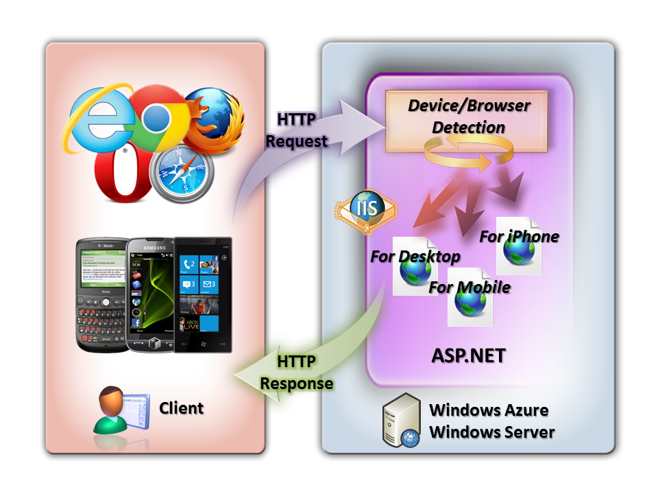
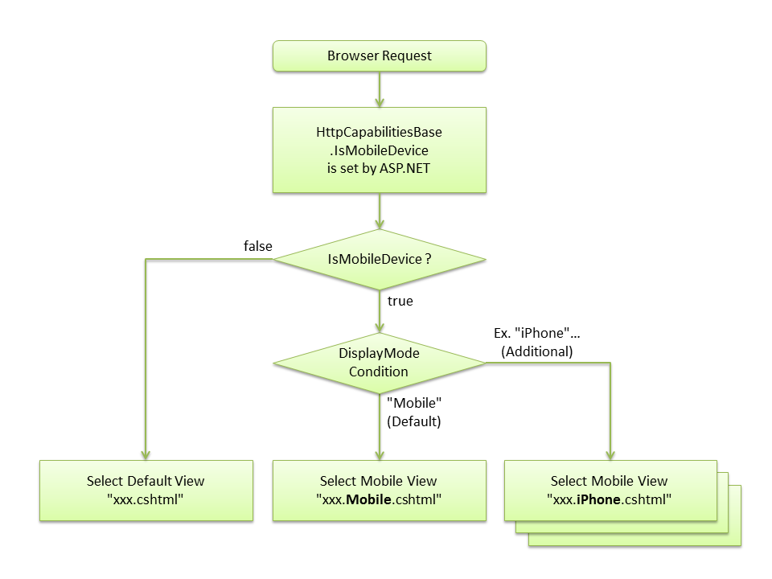
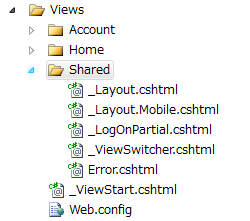
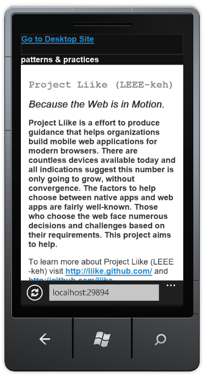
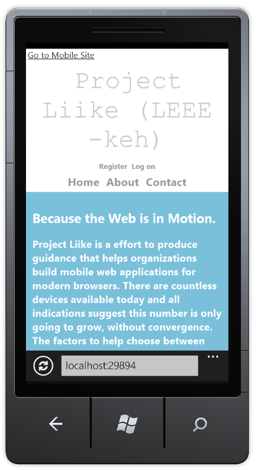
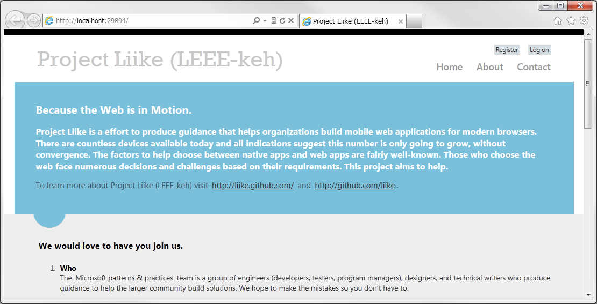
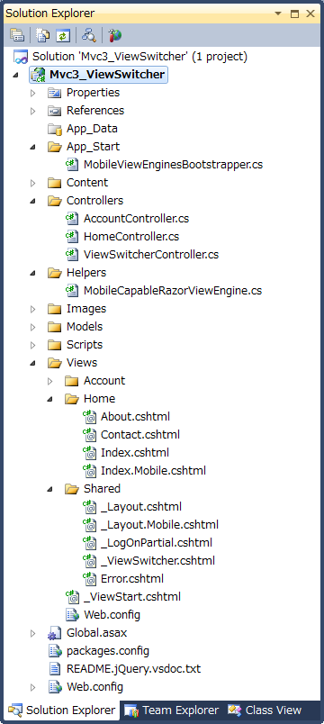
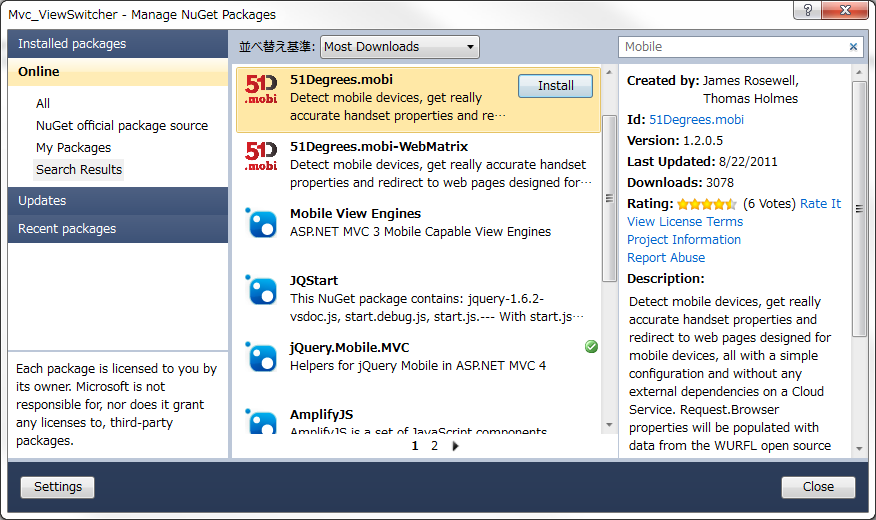
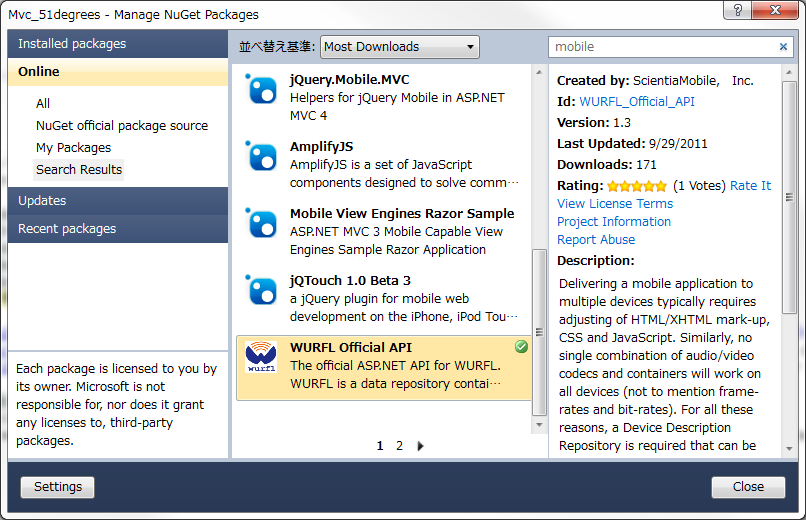
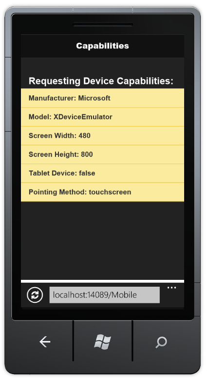

# Mobile Devices Detection and View Switching

## Introduction

Today, we browse various web sites using iPhone, iPad, Android, Windows Phone 7 and so on. Since capabilities differ across devices, web developers sometimes need to detect browser capabilities when developing cross-platform mobile web applications. In some cases, it is best to implement this detection on server side and to deliver different sets of markup depending on the device..
 

This article demonstrates how to 'switch views' when a mobile device is detected. That is, how to deliver different content to a mobile device.In this article, we will use ASP.NET MVC 4 Developer Preview.

>  **Note:** 
> If you want to know how to add mobile web pages to your web application built on ASP.NET Web Forms or ASP.NET MVC 3, please see below:
>
> **How To: Add Mobile Pages to Your ASP.NET Web Forms / MVC Application**
>
> http://www.asp.net/learn/whitepapers/add-mobile-pages-to-your-aspnet-web-forms-mvc-application 

## System Requirements

Before you execute the sample code, the following must be installed:

* Windows 7, Windows Server 2003, Windows Server 2008, Windows Server 2008 R2, Windows Vista, Windows XP
* Visual Studio 2010 SP1 or Visual Web Developer 2010 SP1
* [ASP.NET MVC 4 Developer Preview for Visual Studio 2010](http://www.microsoft.com/download/en/details.aspx?displaylang=en&id=27419)
* [Windows Phone SDK 7.1 - Windows Phone Emulator](http://www.microsoft.com/download/en/details.aspx?displaylang=en&id=27570)
* NuGet version 1.5 or later

## Download Sample Code

You can download a sample code that is used in this article here: 

<https://github.com/liike/aspnet-mvc-mobile-samples>

##Sample Application on Windows Azure

Additionally, you can try the sample application on Windows Azure as follows: 

<http://akirainpp.cloudapp.net/>

## Select a view depending on the browser with ASP.NET MVC 4

### Display Modes in ASP.NET MVC 4 Developer Preview

The **Display Modes** feature of ASP.NET MVC 4 allow a web application select views depending on the browser that is making the request. With this feature, the mobile devices are detected using the standard `Browser.IsMobileDevice` call from `HttpBrowserCapabilities` properties of ASP.NET.

For example, if a desktop browser requests the index page (and `Browser.IsMobileDevice == false`), the application would likely use the `Views\Home\Index.cshtml` as the view. However, if a mobile browser requests the same index page (making `Browser.IsMobileDevice == true`), then then application would return the `Views\Home\Index.Mobile.cshtml` instead.

Layouts and partials can also be overridden based on `Browser.IsMobileDevice` value. For example:

* If your `Views\Shared` folder contains both the `_Layout.cshtml` and `_Layout.Mobile.cshtm`l templates, then by default the application will use `_Layout.Mobile.cshtml` during requests it believes are from mobile browsers and `_Layout.cshtml` during other requests.

* If a folder contains both `_MyPartial.cshtml` and `_MyPartial.Mobile.cshtml`, then the instruction `@Html.Partial("_MyPartial")` will actually render `_MyPartial.Mobile.cshtml` for requests from mobile browsers, and `_MyPartial.cshtml` during other requests.

If you want to create more specific views, layouts, or partial views for other devices, you can register a new `DefaultDisplayMode` instance and specify which name to search for when a request satisfies particular conditions. For example, you could add the following code to the `Application_Start` method in the `Global.asax` file to register the string `"iPhone"` as a display mode that applies when the Apple iPhone browser makes a request:

    DisplayModes.Modes.Insert(0, new DefaultDisplayMode("iPhone") 
    { 
        ContextCondition = (context => context.Request.UserAgent.IndexOf("iPhone", StringComparison.OrdinalIgnoreCase) >= 0) 
    });

After this code runs, when an Apple iPhone browser makes a request, your application will use the `Views\Shared\_Layout.iPhone.cshtml` layout (that is, if ones exists).

## jQuery Mobile with ASP.NET MVC 4

[jQuery Mobile](http://jquerymobile.com/) is a well-known open source library for building touch-optimized mobile web application. jQuery Mobile is included in Mobile Application project template of ASP.NET MVC 4 as default. However, if you want to use jQuery Mobile with an ASP.NET MVC 4 project template, you can download and install it from the Visual Studio Package Manager Console (NuGet) using the following command:

`PM> Install-Package jQuery.Mobile.MVC`

This package installs jQuery Mobile and some helper files, including the following:

* `Views/Shared/_Layout.Mobile.cshtml`, which is a jQuery Mobile-based layout.
* A view-switcher component, which consists of the `Views/Shared/_ViewSwitcher.cshtml` partial view and the `ViewSwitcherController.cs` controller.
 

After you install the package, run your application using a mobile browser (or equivalent, like the [Firefox User Agent Switcher add-on](https://addons.mozilla.org/en-US/firefox/addon/user-agent-switcher/)). You'll see that your pages look quite different, because jQuery Mobile handles layout and styling. To take advantage of this, you can do the following:

* Create mobile-specific view overrides as described under **Display Modes** earlier (for example, create `Views\Home\Index.Mobile.cshtml` to override `Views\Home\Index.cshtml` for mobile browsers).

> **Note:** 
> Read the [jQuery Mobile documentation](http://jquerymobile.com/) to learn more about how to add touch-optimized UI elements in mobile views.

A common convention for mobile-optimized web pages is to add a link whose text is something like “Go to Desktop Site” or “Full site mode” that lets users switch to a desktop version of the page. The jQuery.Mobile.MVC package includes a sample view-switcher component for this purpose.
Sample view-switcher component codes are as follows:

    // from ViewSwitcherController.cs
    using System.Web.Mvc;
    using System.Web.WebPages;

    namespace Mvc_ViewSwitcher.Controllers
    {
        public class ViewSwitcherController : Controller
        {
            public RedirectResult SwitchView(bool mobile, string returnUrl)
            {
                if (Request.Browser.IsMobileDevice == mobile)
                    HttpContext.ClearOverriddenBrowser();
                else
                    HttpContext.SetOverriddenBrowser(mobile ?
                        BrowserOverride.Mobile : BrowserOverride.Desktop);

                return Redirect(returnUrl);
            }
        }
    }

    // _ViewSwitcher.cshtml
    @if (Request.Browser.IsMobileDevice && Request.HttpMethod == "GET")
    {
        

            @if (ViewContext.HttpContext.GetOverriddenBrowser().IsMobileDevice)
            {
                @Html.ActionLink("Go to Desktop Site", "SwitchView", "ViewSwitcher", new { mobile = false, returnUrl = Request.Url.PathAndQuery }, new { rel = "external" })
            } 
            else 
            {
                @Html.ActionLink("Go to Mobile Site", "SwitchView", "ViewSwitcher", new { mobile = true, returnUrl = Request.Url.PathAndQuery }, new { rel = "external" })
            }
        

    }

It's used in the default `Views\Shared\_Layout.Mobile.cshtml` view, and it looks like this when the page is rendered:

  

If you click the link, it switchs to the desktop version of the same page.

In jQuery.Mobile.MVC package, the desktop layout (`_Layout.cshtml`) will not include a view switcher by default, so you won't have a way to get to mobile mode. To enable this, add the following reference to _ViewSwitcher to your desktop layout, just inside the &lt;body&gt; element:

    <body>
        <header>
            @Html.Partial("_ViewSwitcher")
        ...

After adding this the desktop version of the page in mobile browser will include the mobile mode link in it.

   

However, if you browse the desktop version of the page _using desktop browser_, the mobile mode link will _not appear_ in the page.
 
   

The view switcher uses a new feature of ASP.NET MVC 4 called **Browser Overriding**. This feature lets your application treat requests as if they were coming from a different browser (user agent) than the one they're actually from. The following table lists the methods that Browser Overriding provides.

<table>
    <tr>
        <td>HttpContext.SetOverriddenBrowser(userAgentString)</td>
        <td>Overrides the request's actual user agent value using the specified user agent.</td>
    </tr>
    <tr>
        <td>HttpContext.GetOverriddenUserAgent()</td>
        <td>Returns the request's user agent override value or the actual user agent string if no override has been specified.</td>
    </tr>
    <tr>
        <td>HttpContext.GetOverriddenBrowser()</td>
        <td>Returns an `HttpBrowserCapabilitiesBase` instance that corresponds to the user agent currently set for the request (actual or overridden). You can use this value to get properties such as `IsMobileDevice`.</td>
    </tr>
    <tr>
        <td>HttpContext.ClearOverriddenBrowser()</td>
        <td>Removes any overridden user agent for the current request.</td>
    </tr>
</table>

Browser Overriding is a core feature of ASP.NET MVC 4 and is available even if you don't install the jQuery.Mobile.MVC package. However, it affects only view, layout, and partial-view selection — it does not affect any other ASP.NET feature that depends on the Request.Browser object.

By default, the user-agent override is stored using a cookie. If you want to store the override elsewhere (for example, in a database), you can replace the default provider (`BrowserOverrideStores.Current`).

## Select views depending on the browser with ASP.NET MVC 3

If you use ASP.NET MVC 3, you can use the `MobileViewEngines` package. To install it from the Visual Studio Package Manager Console (NuGet), type the following command:

`PM> Install-Package MobileViewEngines`

Unfortunately you cannot use the Display Modes feature with ASP.NET MVC 3. Instead, you have to write some additional code. The following is an example of what you can add your ASP.NET MVC 3 project based on MobileViewEngines.

1. After the MobileViewEngines installation, add the following codes to `MobileCapableRazorViewEngine.cs` (or `MobileCapableRazorViewEngine.vb`): 
    
        private ViewEngineResult NewFindView(ControllerContext controllerContext, string viewName, string masterName, bool useCache, bool isPartialView)
        {
            if (!ContextCondition(controllerContext.HttpContext))
            {
                return new ViewEngineResult(new string[] { });
            }

            HttpCookie viewSwitcher = controllerContext.RequestContext.HttpContext.Request.Cookies["ViewSwitcher"];

            if (viewSwitcher != null && viewSwitcher["Mobile"] != null)
            {
                if (String.Equals(viewSwitcher["Mobile"], "false"))
                    return new ViewEngineResult(new string[] { });
            }

            ...

2. Add the following Controller code as `ViewSwitcherController.cs` to your project: 

        using System.Web.Mvc;
        using System.Web.WebPages;

        namespace Mvc_ViewSwitcher.Controllers
        {
            public class ViewSwitcherController : Controller
            {
                public RedirectResult SwitchView(bool mobile, string returnUrl)
                {
                    Response.Cookies["ViewSwitcher"]["Mobile"] = (mobile ? "true" : "false");

                    return Redirect(returnUrl);
                }
            }
        }

3. Add the following View code as `_ViewSwitcher.cshtml` to your project:
 
        @if (Request.Browser.IsMobileDevice && Request.HttpMethod == "GET")
        {
            

                @{
                    bool isMobileMode = Request.Browser.IsMobileDevice;

                    if (Request.Cookies["ViewSwitcher"] != null && Request.Cookies["ViewSwitcher"]["Mobile"] != null)
                    {
                        isMobileMode = String.Equals(Request.Cookies["ViewSwitcher"]["Mobile"], "true");
                    }

                    if (isMobileMode)
                    {
                        @Html.ActionLink("Go to Desktop Site", "SwitchView", "ViewSwitcher", new { mobile = false, returnUrl = Request.Url.PathAndQuery }, new { rel = "external" })
                    }
                    else
                    {
                        @Html.ActionLink("Go to Mobile Site", "SwitchView", "ViewSwitcher", new { mobile = true, returnUrl = Request.Url.PathAndQuery }, new { rel = "external" })
                    }
                }
            

        }

4.  Unfortunately, you have to prepare not only `_Layout.Mobile.cshtml`, but also mobile content view (such as `Index.Mobile.cshtml`), and add the following line to the mobile content view: 

        @{
            ViewBag.Title = "Project Liike (LEEE-keh)";
            Layout = "~/Views/Shared/_Layout.Mobile.cshtml";
        }

    ** Note: You may need to consider other solution later **

5.  Finally, add the following reference to `_ViewSwitcher` to your layout view: 

        @Html.Partial("_ViewSwitcher")

Following figure is a sample ASP.NET MVC 3 project based on MobileViewEngines: 
 
   

For more details, you can download a sample code based on ASP.NET MVC 3 as follows: 
<https://github.com/liike/aspnet-mvc-mobile-samples/tree/master/Mvc3>

In this sample, HTTP Cookie is used instead of the Display Modes feature implemented in ASP.NET MVC 4.

## Detect mobile devices and browser capabilities

In Display Modes of ASP.NET MVC 4, the mobile devices detection is using the standard Browser.IsMobileDevice call from HttpBrowserCapabilities Properties of ASP.NET.

> **HttpBrowserCapabilities Properties of ASP.NET:**
> <http://msdn.microsoft.com/en-us/library/system.web.httpbrowsercapabilities_properties.aspx>

If you want to implement more specific detection, you can use a browser database like 51Degrees.mobi and WURFL Official API (also on CodePlex and NuGet).

### 51Degrees.mobi

51Degrees.mobi: <http://51degrees.codeplex.com/>

Detect mobile devices, get very accurate handset properties and redirect to web pages designed for mobile devices, all with a simple configuration and without any external dependencies on a Cloud Service. Request.Browser properties will be populated with data from the WURFL open source project so you can still use the default .NET properties but be assured that they're accurate.

`PM> Install-Package 51Degrees.mobi`
 
   

### WURFL Official API

WURFL Official API: <http://wurfl.sourceforge.net/>

WURFL is a data repository containing the description of thousands of mobile devices. You use the library to query browser and device capabilities from the user-agent string. Delivering a mobile application to multiple devices typically requires adjusting of HTML/XHTML mark-up, CSS and JavaScript. Similarly, no single combination of audio/video codecs and containers will work on all devices (not to mention frame-rates and bit-rates). For all these reasons, a Device Description Repository is required that can be queried to know whether a given device supports a given feature. An open-source database, WURFL is de-facto standard DDR in the industry. This package delivers the official WURFL ASP.NET API.

`PM> Install-Package WURFL_Official_API`
 
   

### Accurate browser capabilities

Depending on your application, it may also be important to detect browser capabilities such as screen size, pointing method and so on.

The following code returns the mobile device browser capabilities. These calls will return more accurate data than `HttpBrowserCapabilities` properties of ASP.NET if you use the 51degrees.mobi and WURFL Official API.

    var Manufacturer = Request.Browser.MobileDeviceManufacturer;
    var DeviceModel = Request.Browser.MobileDeviceModel;
    var ScreenWidth = Request.Browser.ScreenPixelsWidth;
    var ScreenHeight = Request.Browser.ScreenPixelsHeight;
    var TabletDevice = Request.Browser["is_tablet"];
    var PointingMethod = Request.Browser["pointing_method"];

The following figure is a sample of mobile web application that is using 51degrees.mobi. You can detect screen size, pointing method and so on easily.

   

## Summary

The demand and importance for modern mobile web development is rapidly increasing recently. Because we have to build web applications that we can use anytime, anywhere and on any device, understanding when and how to use techniques such as the ones outlined in this article are an important component of cross-platform mobile web development. 

_Akira Inoue - November 2nd, 2011_

## Bibliography

**ASP.NET MVC 4 Developer Preview Release Note**
_(Display Modes and jQuery Mobile, the View Switcher, and Browser Overriding)_
<http://www.asp.net/learn/whitepapers/mvc4-release-notes#_Toc303253810>

**New Mobile View Engines for ASP.NET MVC 3, spec-compatible with ASP.NET MVC 4**
<http://www.hanselman.com/blog/NuGetPackageOfTheWeek10NewMobileViewEnginesForASPNETMVC3SpeccompatibleWithASPNETMVC4.aspx>

**HttpBrowserCapabilities Properties of ASP.NET**
<http://msdn.microsoft.com/en-us/library/system.web.httpbrowsercapabilities_properties.aspx>

**How To: Add Mobile Pages to Your ASP.NET Web Forms / MVC Application**
<http://www.asp.net/learn/whitepapers/add-mobile-pages-to-your-aspnet-web-forms-mvc-application>

**51Degrees**
<http://51degrees.mobi>
<http://51degrees.codeplex.com/>
<http://nuget.org/List/Packages/51Degrees.mobi>

**WURFL Official API**
<http://www.scientiamobile.com/site/index>
<http://nuget.org/List/Packages/WURFL_Official_API>